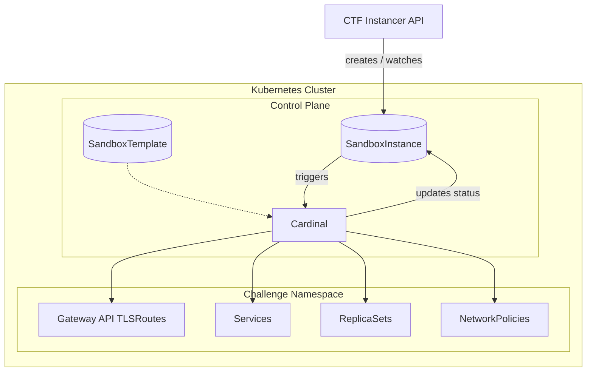

# Aincrad

A Kubernetes-native CTF infrastructure orchestrator and collection of deployment utilities.

Aincrad is an overhaul of our previous challenge instancing setup (`kube-ctf`). The goal is to cut down the administrative friction of testing and deploying CTF challenges: replacing raw YAML templates, ad-hoc cleanup scripts, and over-privileged web frontends with a proper Kubernetes controller.

[`QUICKSTART.md`](QUICKSTART.md) should have all the information you have to deploy Cardinal and write your first challenge.

## Background
Managing on-demand isolated challenge infrastructure for CTFs came with a lot of operational pain:
- Challenge authors had to pass in raw Kubernetes manifests without validation, so broken configs only showed up when applied to the cluster.
- Shared and isolated challenges were treated as different systems, requiring separate templates and deployment pipelines.
- When an instancer crashed mid-provision, abandoned resources were left in an indeterminate state because there was no reconciliation loop to clean them up.
- Port management across dozens of challenges meant manually tracking reservations and port forwarding rules in spreadsheets. Which is why we never gotten around to having port-based isolated challenges.
- Instancer frontends often needed broad cluster-admin permissions in order to create arbitrary workloads.


## How Cardinal Works

Everything in Cardinal is modeled around two Custom Resource Definitions:

- `SandboxTemplate` (`cardinal.noctf.dev/v1`): The blueprint defining a challenge. It wraps standard PodSpecs (giving authors flexibility plus toggles like `allowInternet`), parameters, and route definitions. Shared challenges and per-team instances use the exact same format.
- `SandboxInstance` (`cardinal.noctf.dev/v1`): A running sandbox provisioned for a player or team, pointing at a template with a TTL (`expiresAt`). Instances are pinned immutable snapshots of their template at spawn time to protect active player state.

Moving this to a controller solves the main administrative headaches:
- A single `SandboxTemplate` works whether a challenge is shared across all players or instanced hundreds of times. Cardinal handles child ReplicaSets, headless discovery Services, and NetworkPolicies automatically.
- Child resources carry standard Kubernetes `ownerReferences`, so when an instance expires or is deleted, Kubernetes cascades the cleanup cleanly without needing external tools like `kube-janitor`.
- Web frontends only need permissions to create and watch `SandboxInstance` objects in a single namespace. Cardinal evaluates child readiness and surfaces conditions directly on the instance status.
- Cardinal handles dynamic TCP/UDP port allocation from a pool (`--auto-ports`) and derives deterministic TLS hostnames via Gateway API.


## Architecture




## Workspace Structure

The project is organised as a cargo workspace:

- [`crates/cardinal`](crates/cardinal): The core Kubernetes controller daemon, CLI, and reconciliation logic.
- [`crates/k8s-common`](crates/k8s-common): Shared Kubernetes data types, CRD definitions, label constants, and policy helpers.
- [`crates/macros`](crates/macros): Workspace procedural macros.
- [`crds/`](crds): Auto-generated Custom Resource Definition manifests.
- [`examples/`](examples): Example manifests for deploying Cardinal, web challenges, TCP/pwn challenges, and multi-service setups.


## Cluster & Environment Requirements

So far, Aincrad has only been validated in production on **Google Kubernetes Engine (GKE)**, though it should work in other environments as well.

The main piece you need is some routing layer to handle the L4 LoadBalancer Services:
- On GKE, we run Dataplane v2 (Cilium). To avoid cloud load balancer quotas and expensive per-challenge forwarding rules, we set the `loadBalancerClass` so that GKE's cloud controller ignores the service. We then patch the service spec with our load-balancer's IP to get Cilium to route it. 
- On bare metal, you'll need an on- or off-cluster proxy (or load balancer controller) capable of watching these `LoadBalancer` specs to route the incoming port range to your nodes.


## Configuration

Cardinal is configured via a YAML configuration file. By default, it automatically loads `/etc/cardinal/config.yaml` (typically mounted from a ConfigMap in Kubernetes), or uses built-in defaults if running without a config file.

You can specify a custom configuration file path using `--config <path>` (or `CARDINAL_CONFIG=<path>`):

```bash
cargo run --bin cardinal -- --config ./examples/config.example.yaml
```

An example configuration:

```yaml
namespaces:
  - challenges

systemNamespace: cardinal-system

routing:
  hostnameSuffix: c.example.com
  tlsPort: 443
  seed: super-secret-random-seed-value
  loadBalancerIp: 1.2.3.4

ports:
  reserved:
    - 20000-29999
  auto:
    - 30000-32767

imageAliases:
  _challenges: gcr.io/my-ctf-project/challenges
```

## Notes
This codebase was written with the assistance of AI coding tools.
